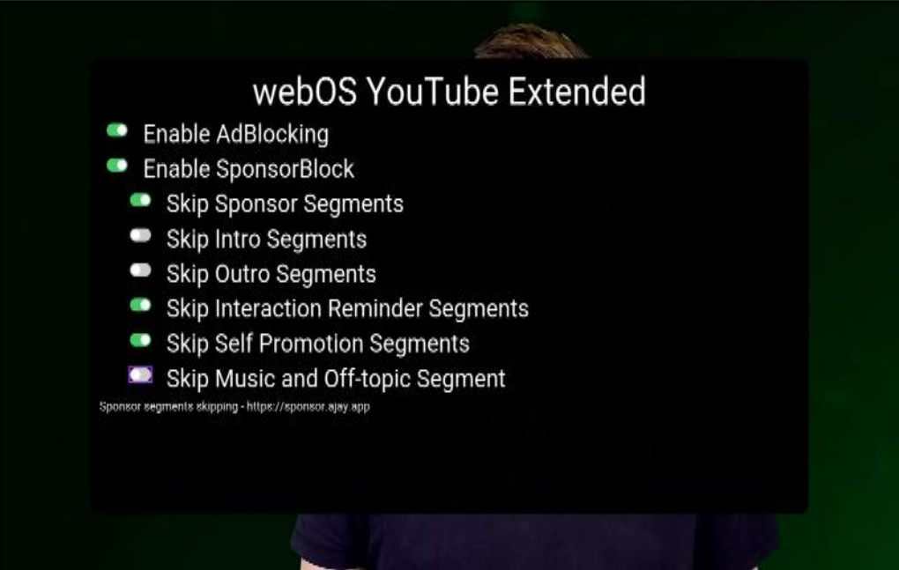
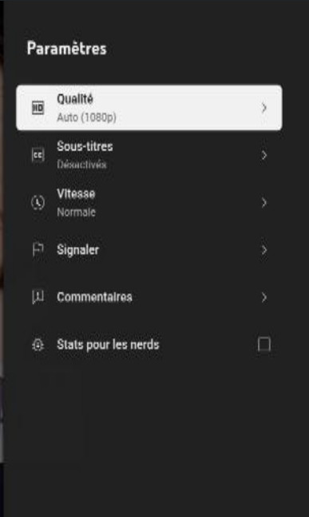

# youtube-webos-cobalt

YouTube App built with [Cobalt](https://cobalt.googlesource.com/cobalt/) with extended functionalities.

This project is built on top of [youtube-webos](https://github.com/webosbrew/youtube-webos).

Cobalt [only support a subset of HTML tags](https://cobalt.dev/development/reference/supported-features.html),
youtube-webos had to be reworked to only use `div` tag.





## Features

Same as the default youtube application:
- Speed management

Same as youtube-webos:
- Advertisements blocking
- [SponsorBlock](https://sponsor.ajay.app/) integration
- [Autostart](#autostart)


**Note:** Configuration screen can be opened by pressing 🟩 GREEN button on the remote.

## Pre-requisites

- Official YouTube app needs to be uninstalled before installation.

## Installation

- Use [webOS Homebrew Channel](https://github.com/webosbrew/webos-homebrew-channel) - app is published in official webosbrew repo
- Use [Device Manager app](https://github.com/webosbrew/dev-manager-desktop) - see [Releases](https://github.com/webosbrew/youtube-webos/releases) for a
  prebuilt `.ipk` binary file
- Use official webOS/webOS OSE SDK: `ares-install youtube...ipk` (for webOS SDK configuration
  see below)

## Configuration

Configuration screen can be opened by pressing 🟩 GREEN button on the remote.

### Autostart

In order to autostart an application the following command needs to be executed
via SSH or Telnet:

```sh
luna-send-pub -n 1 'luna://com.webos.service.eim/addDevice' '{"appId":"youtube.leanback.v4","pigImage":"","mvpdIcon":""}'
```

This will make "YouTube AdFree" display as an eligible input application (next
to HDMI/Live TV, etc...), and, if it was the last selected input, it will be
automatically launched when turning on the TV.

This will also greatly increase startup performance, since it will be runnning
constantly in the background, at the cost of increased idle memory usage.
(so far, relatively unnoticable in normal usage)

In order to disable autostart run this:

```sh
luna-send -n 1 'luna://com.webos.service.eim/deleteDevice' '{"appId":"youtube.leanback.v4"}'
```

## Patching your IPK

- Install docker:

Follow instructions on https://docs.docker.com/engine/install/

Make sure to install all docker components like `docker-buildx-plugin` and `docker-compose-plugin`.

- Install tools

```sh
sudo apt install jq git patch sed binutils squashfs-tools rename findutils xz-utils
```


- Clone the repository

```sh
git clone https://github.com/GuillaumeSmaha/youtube-webos-cobalt.git
```

- Enter the folder and you can patch your YouTube ipk
```sh
cd youtube-webos-cobalt

make PACKAGE=./your-tv-youtube.ipk
```

Customize package name:
`PACKAGE_NAME` can be defined to change the package name
```sh
make PACKAGE=./your-tv-youtube.ipk PACKAGE_NAME=youtube-free.leanback.v4
```

## Build Cobalt

If you need to update Cobalt patches or if you don't trusted pre-compiled version stored in `cobalt-bin`, you can build them yourself.

The building process is:
- Clone cobalt repository
- Apply the patch defined in `cobalt-patches` directory to inject AdBlock javascript after the document is loaded.
- Build libcobalt.so using docker-compose method.

This process is handled by the following commands:
- Clone the repo, enter the folder and call the build command, this will generate libcobalt.so file for the given versions.
`make cobalt-bin/<COBALT_VERSION>-<SB_API_VERSION>/libcobalt.so cobalt-bin/<COBALT_VERSION>-<SB_API_VERSION>.xz`

For example: for Cobalt 23.lts.4 and SB Api version 12:
```sh
git clone https://github.com/FriedChickenButt/youtube-webos.git

cd youtube-webos-cobalt

make cobalt-bin/23.lts.4-12/libcobalt.so cobalt-bin/23.lts.4-12.xz
```

Then, you can call `make PACKAGE=./your-tv-youtube.ipk` to rebuild an IPK with your updated version of Cobalt

### Building issue

If you already built cobalt for a different version and got an error like `node-gyp not found`:

Try to clean docker image used to build and retry.
```sh
docker image rm cobalt-build-evergreen cobalt-build-linux cobalt-build-base cobalt-base
```

Try to clean old Cobalt builds and retry:
```sh
rm -fr cobalt/out/
make cobalt-clean
```

## Build Youtube-Webos

If you need to update Youtube-webos or if you don't trusted pre-generated version stored in `youtube-webos/output`, you can build them yourself.

```sh
git clone https://github.com/FriedChickenButt/youtube-webos.git

cd youtube-webos-cobalt

make npm-docker
```

After calling `make npm-docker`, files in `youtube-webos/output` will be updated.
Then, you can call `make PACKAGE=./your-tv-youtube.ipk` to rebuild an IPK with your updated version of Youtube-webos


## Development TV setup

### Configuring @webosose/ares-cli with Developer Mode App

This is partially based on: https://webostv.developer.lge.com/develop/app-test/using-devmode-app/

- Install Developer Mode app from Content Store
- Enable developer mode, enable keyserver
- Download TV's private key: `http://TV_IP:9991/webos_rsa`
- Configure the device using `ares-setup-device` (`-a` may need to be replaced with `-m` if device named `webos` is already configured)
  - `PASSPHRASE` is the 6-character passphrase printed on screen in developer mode app

```sh
ares-setup-device -a webos -i "username=prisoner" -i "privatekey=/path/to/downloaded/webos_rsa" -i "passphrase=PASSPHRASE" -i "host=TV_IP" -i "port=9922"
```

### Configuring @webosose/ares-cli with Homebrew Channel / root

- Enable sshd in Homebrew Channel app
- Generate ssh key on developer machine (`ssh-keygen`)
- Copy the public key (`id_rsa.pub`) to `/home/root/.ssh/authorized_keys` on TV
- Configure the device using `ares-setup-device` (`-a` may need to be replaced with `-m` if device named `webos` is already configured)

```sh
ares-setup-device -a webos -i "username=root" -i "privatekey=/path/to/id_rsa" -i "passphrase=SSH_KEY_PASSPHRASE" -i "host=TV_IP" -i "port=22"
```

**Note:** @webosose/ares-cli doesn't need to be installed globally - you can use a package installed locally after `cd youtube-webos && npm install` in this repo by just prefixing above commands with local path, like so: `node_modules/.bin/ares-setup-device ...`

## Installation

```
cd youtube-webos
npm run deploy
```

## Launching

- The app will be available in the TV's app list or launch it using ares-cli.

```sh
cd youtube-webos
npm run launch
```

To jump immediately into some specific video use:

```sh
cd youtube-webos
npm run launch -- -p '{"contentTarget":"v=F8PGWLvn1mQ"}'
```
